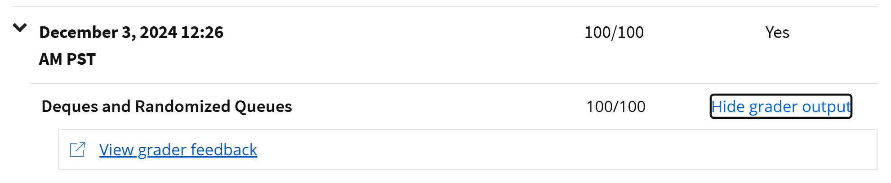

# What about course?
Implement and apply data structures and algorithms in programming.
Analyze and evaluate the efficiency of algorithms.
Choose appropriate data structures for specific problems.
Solve computational problems using the techniques learned throughout the course.

“ Algorithms + Data Structures = Programs. ” — Niklaus Wirth
  

# Tasks and Assignments
1. **Programming Assignments**:
    * You will complete several coding assignments that require you to implement specific data structures and  algorithms. For example:
        * Implementing a Percolation model to understand network flow and connectivity.
        * Working on randomized algorithms and implementing algorithms like red-black BST, quicksort and mergesort.
        * problem sets that challenge you to apply the algorithms and data structures you've learned to solve theoretical problems.

  

 2. **Peer Graded Assignments:**
     * me assignments may involve peer review, where you submit your work and review submissions from The system. This process helps reinforce learning through feedback.          
    
  

## Percolation

  

## Deques and Randomized Queues

        
    
